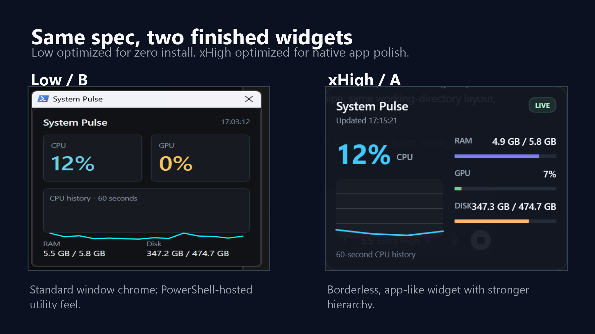
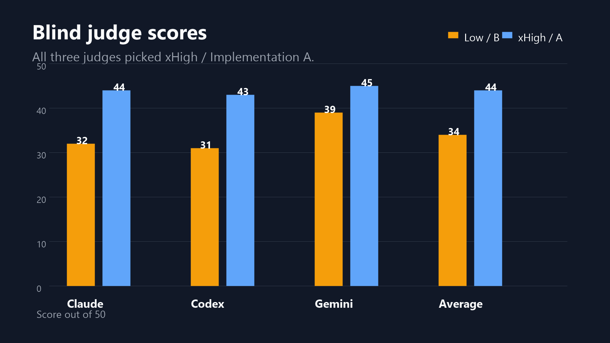

# Codex Low vs xHigh Thinking Experiment


A small, public, lighthearted research artifact: same prompt, same starting state, two Codex reasoning levels, two runnable Windows desktop widgets, and three blind LLM judges.

The short version: xHigh won all three blind judgments, averaging 44/50 versus 34/50 for Low. It also cost more time and tokens. That is the whole point of the experiment: compare the artifact, not just the vibe.



## What Is In Here

- `ARTICLE.md` - a long-form X Article draft for publishing the story.
- `PUBLISHING.md` - notes for posting the article on X, including image upload order.
- `TEASER_POST.md` - a short X post to share the article.
- `RESULTS.md` - the measured results, judge scores, and findings.
- `PROMPT.md` - the exact prompt used for both runs.
- `RUN_PROTOCOL.md` - the execution and measurement protocol.
- `RUBRIC.md` - the judging rubric.
- `MAPPING.md` - the revealed A/B mapping after judging.
- `apps/xhigh-system-pulse/` - the xHigh .NET 8 WPF app.
- `apps/low-system-pulse/` - the Low PowerShell/WPF app.
- `judges/` - cleaned judge verdicts.
- `assets/` - postable charts, screenshots, and the article header image.
- `data/` - compact measurement data.

Raw transcripts, local orchestration files, and temporary runner logs are intentionally excluded from the public repo. They are useful locally, but they make a public research repo worse.

## Run The Apps

xHigh version:

```powershell
cd apps\xhigh-system-pulse
dotnet run --project .\src\SystemPulse\SystemPulse.csproj -c Release
```

Low version:

```powershell
cd apps\low-system-pulse
powershell -ExecutionPolicy Bypass -File .\SystemPulse.ps1
```

Both target Windows 11. The xHigh version requires the .NET 8 SDK; the Low version uses built-in PowerShell and WPF.

## Result Snapshot

| Metric | Low | xHigh |
|---|---:|---:|
| Average judge score | 34/50 | 44/50 |
| Wall-clock seconds | 499.5 | 793.9 |
| Output tokens | 10,839 | 27,032 |
| Stack | PowerShell + WPF | .NET 8 WPF |
| App CPU avg | 0.150% | 0.088% |
| App RAM | 158.1 MB | 128.9 MB |



## Caveat

This is not a benchmark suite. It is one controlled artifact comparison on one Windows widget task. Treat it as evidence, not gospel.
